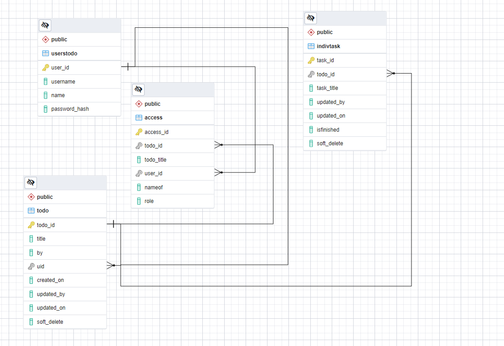

## A collaborative todo list application

### Project Requirements
[Requirements](./misc/backend_capstone.pdf) please see file in misc folder 
### ERD Diagram
 please see file in misc folder

### Project Initialisation and local usage

#### project setup

* npm install
* npm run db:migrate
* 
#### App usage
for development
* npm run dev
* docker run -d -p 5672:5672 -p 15672:15672 rabbitmq:3-management  
* npm run consume
* use postman to test endpoints

for production
* npm run start
* docker run -d -p 5672:5672 -p 15672:15672 rabbitmq:3-management  
* npm run consume
* swagger docs : https://backend-capstone-px.herokuapp.com/api-docs/

### Deployment on Heroku

* Deployed using heroku interface
* heroku addons:create heroku-postgresql:hobby-dev
* heroku addons:create cloudamqp:lemur
* see [procfile](procfile)
* Herokuapp : https://backend-capstone-px.herokuapp.com/
* swagger docs : https://backend-capstone-px.herokuapp.com/api-docs/

##### To note:
 integration test are partial 
 
 cron to display number of complete task able to display , howver end point does pick up the mesages 
 to see cron display  
* npm run cron
 

